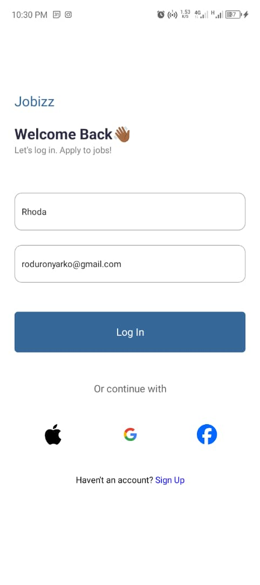

# Jobizz App

## STUDENT ID - 11357247

## Description
Jobizz is a job application app designed to help users find and apply to jobs easily. The app consists of a login screen and a homepage displaying featured and popular jobs.


## Component

### LoginScreen
Located in `screens/LoginScreen.jsx`, this component allows users to log in using their name and email. It includes input fields for the name and email, a "Log In" button, and options to log in with social media accounts (Apple, Google and Facebook). Upon successful login, it navigates to the HomeScreen, passing the user’s name and email.

### HomeScreen
Located in `screens/HomeScreen.jsx`, this component displays the user's name and email at the top of the screen, followed by a search bar, featured jobs in a horizontal scroll view, and a list of popular jobs. It receives the user's name and email as props from the LoginScreen.

### JobCard
Located in `components/JobCard.jsx`, this component displays information about a job, including the company logo, role, company name, salary, and location. It accepts a `details` prop containing job information.

## Screenshots

### Login Screen


### Home Screen


## Usage
1. Clone the repository.
2. Install dependencies with `npm install`.
3. Start the app with `npm start`.

### Additional Setup for React Navigation
To use React Navigation, ensure you have the necessary packages installed:
```bash
npm install @react-navigation/native @react-navigation/stack
expo install react-native-screens react-native-safe-area-context
